# MJL Bar

<div align="center">
  
</div>

> App móvil para la gestión integral de un bar — desarrollada como Trabajo Final Integrador de la carrera.

[](https://ionicframework.com/)
[](https://angular.io/)
[](https://supabase.com/)
[](https://capacitorjs.com/)
[](https://www.typescriptlang.org/)

---

## 🎓 Acerca del proyecto

**MJL Bar** es una aplicación móvil desarrollada como **Trabajo Final Integrador** de la carrera. La app cubre la gestión completa de un bar: desde el ingreso de clientes por QR, la toma de pedidos en tiempo real, cocina y barra independientes, hasta encuestas de satisfacción con gráficos y juegos con descuentos.

**Este es un trabajo grupal** realizado por tres integrantes.

---

## 👥 Equipo

<table>
  <tr>
    <td align="center">
      <a href="https://github.com/Matias-Emanuel-Castillo-Dev">
        
        <br/><strong>Matías Emanuel<br/>Briceño Castillo</strong>
      </a>
    </td>
    <td align="center">
      <a href="https://github.com/JuanDChaves">
        
        <br/><strong>Juan David<br/>Chaves Rodriguez</strong>
      </a>
    </td>
    <td align="center">
      <a href="https://github.com/luli-pok">
        
        <br/><strong>Lucía Laura<br/>Pokoik</strong>
      </a>
    </td>
  </tr>
</table>

---

## ✨ Funcionalidades

| Módulo | Descripción |
|---|---|
| **7 perfiles de usuario** | dueño, supervisor, metre, mozo, cocinero, cantinero, cliente — cada uno con home y permisos específicos |
| **Registro y aprobación** | Alta de clientes con foto de perfil y escaneo de DNI por QR; aprobación por supervisor/dueño antes de acceder |
| **Ingreso anónimo** | Clientes sin cuenta pueden jugar para obtener descuentos |
| **Gestión de mesas** | Alta de mesas con foto y QR propio; asignación dinámica de mesas a clientes |
| **Menú digital** | Alta de platos y bebidas con hasta 3 fotos por producto |
| **Pedidos en tiempo real** | Máquina de estados: pendiente → en preparación (cocina/barra) → entregado → pagado; sectores independientes |
| **Chat mozo-cliente** | Comunicación en tiempo real por mesa vía Supabase Realtime |
| **Juegos con descuentos** | Ahorcado, Mayor/Menor y Ruleta; cada juego otorga un porcentaje de descuento sobre la cuenta |
| **Encuestas de satisfacción** | Encuestas con gráficos de resultados en tiempo real (Chart.js) |
| **Cuenta y propina** | Detalle de consumo con aplicación automática de descuentos y selección de propina por QR |
| **Push notifications** | Notificaciones push a supervisores/duaños ante nuevos registros; confirmación por email al cliente |
| **Envío de correos** | Emails transaccionales de aprobación/rechazo de registro vía Resend |

---

## 🛠️ Stack tecnológico

| Capa | Tecnología |
|---|---|
| **Framework móvil** | [Ionic 8](https://ionicframework.com/) |
| **Framework web** | [Angular 20](https://angular.io/) — standalone components, signals, lazy loading |
| **Backend** | [Supabase](https://supabase.com/) — Auth, Postgres, Storage, Realtime, Edge Functions, RPC |
| **Push notifications** | Firebase Cloud Messaging (FCM) vía Edge Function |
| **Email transaccional** | [Resend](https://resend.com/) |
| **Componentes nativos** | [Capacitor 8](https://capacitorjs.com/) — Push Notifications, Camera, Barcode Scanner, Haptics, Native Audio, Preferences, App |
| **Lenguaje** | [TypeScript 5.9](https://www.typescriptlang.org/) |
| **Gráficos** | [Chart.js](https://www.chartjs.org/) |
| **Gestor de paquetes** | [pnpm](https://pnpm.io/) |
| **Linting** | ESLint |
| **Testing** | Karma + Jasmine |

---

## 🏗️ Arquitectura y buenas prácticas

### Estructura del proyecto (`src/app/`)

```
src/app/
├── components/          # Componentes reutilizables (login, registro, layout, etc.)
│   ├── agregar-mesa-form/
│   ├── alta-producto/
│   ├── anonymous-user-registration-form/
│   ├── chat/
│   ├── detalle-cuenta/
│   ├── encuesta/
│   ├── games/
│   ├── Home/            # Homes por perfil (supervisor, metre, mozo, cocinero, cantinero, cliente)
│   ├── layout/
│   ├── login-form/
│   ├── pedidos/
│   ├── registration-form/
│   └── seleccionar-propina/
├── guards/              # Guards funcionales (is-logged)
├── interfaces/          # ~25 interfaces de dominio (IUser, IPedido, IMesa, etc.)
├── pages/               # Páginas principales con lazy loading
├── pipes/               # Pipes (error-message)
├── services/            # Lógica de negocio y acceso a datos
├── splash-screen/
└── types/               # Tipos globales (TipoPerfil, TipoMesa, etc.)
```

### Patrones y decisiones técnicas

| Patrón | Aplicación |
|---|---|
| **Standalone components** | 100% de componentes sin NgModules; imports explícitos de `@ionic/angular/standalone` |
| **Angular Signals** | `signal()`, `computed()`, `toSignal()` / `toObservable()` para estado reactivo en toda la app |
| **Lazy loading** | Las 26 rutas usan `loadComponent` con importación dinámica |
| **Inyección con `inject()`** | Servicios y guard injection vía `inject()` en lugar de constructores con parámetros |
| **Reactive Forms** | `FormGroup`/`FormControl` con validadores (DNI 7-8 dígitos, CUIL 11, regex de nombres) |
| **Patrón `IResult<T>`** | Wrapper uniforme `{success, error, data}` en todos los servicios |
| **DAO genérico** | `DbService<T extends BaseEntity>` con CRUD genérico + soft-delete (`activo: false`) |
| **RPCs de Postgres** | Lógica transaccional en la base de datos (`insertar_productos_pedido`, `terminar_sector_pedido`, etc.) |
| **Edge Functions** | `create-user`, `push` (FCM), `send-email` (Resend) — lógica server-side segura |
| **Tipos generados** | `database.types.ts` generado automáticamente por `supabase gen types typescript --linked` |
| **Pipe de errores** | `error-message.pipe` traduce validaciones de `AbstractControl` a mensajes en español |

### Flujo de notificaciones push

```
Cliente se registra en la app
        ↓
Frontend: INSERT en tabla `notifications`
          (title, body, data: {cliente_id, tipo: "registro_pendiente"})
        ↓
Webhook de Supabase detecta INSERT → dispara Edge Function `push`
        ↓
Edge Function:
  a) Lee el registro de `notifications`
  b) Query `usuarios` → perfiles (supervisor, duenio) con fcm_token
  c) Por cada destinatario → obtiene access_token (Service Account Firebase)
     → HTTP POST a FCM API v1 → push entregada al dispositivo
        ↓
Supervisor/Dueño recibe la notificación → toca → abre la pantalla de solicitudes
```

---

## 🔒 Seguridad

| Práctica | Detalle |
|---|---|
| **Autenticación** | Supabase Auth (email/password); contraseñas gestionadas exclusivamente por Supabase |
| **Flujo de aprobación** | Clientes nuevos se crean con `activo = false`; no pueden iniciar sesión hasta ser aprobados por supervisor/dueño |
| **Edge Functions con service role** | La creación de usuarios de empleados se hace vía Edge Function `create-user` (service role key nunca expuesta al cliente) |
| **verify_jwt** | Las 3 Edge Functions requieren JWT válido (`verify_jwt = true` en config.toml) |
| **RLS habilitado** | Row Level Security activo en las tablas de Supabase |
| **Validaciones cliente** | Formularios con validadores: regex DNI (7-8 dígitos), CUIL (11), email, nombres (solo letras con tilde/Eñe) |
| **Soft-delete** | Los registros no se eliminan físicamente; se marcan como `activo = false` |
| **Logout seguro** | Al cerrar sesión se elimina el `fcm_token` de la base de datos y se limpian las Preferences del dispositivo |

---

## 📱 Capturas de la App

### Autenticación y registro

<table>
  <tr>
    <td></td>
    <td>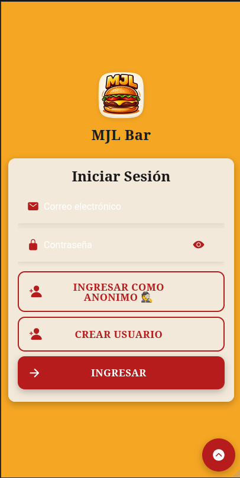</td>
    <td></td>
  </tr>
</table>
<details><summary>🔍 Ver en tamaño original</summary>

  
  
  
</details>

<table>
  <tr>
    <td>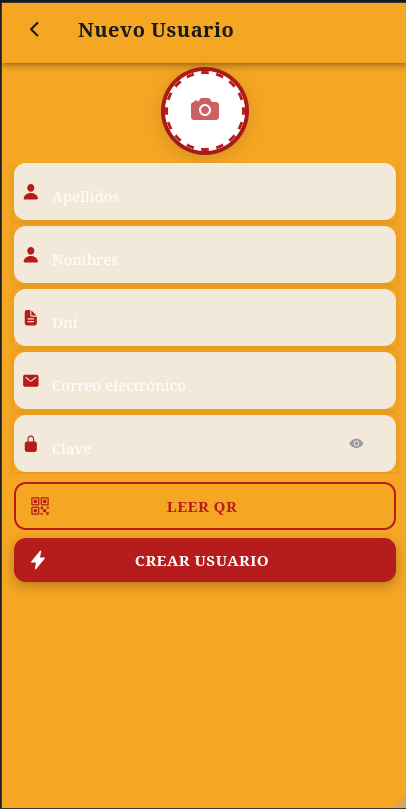</td>
    <td></td>
  </tr>
</table>
<details><summary>🔍 Ver en tamaño original</summary>

  
  
</details>

---

### Homes por perfil

<table>
  <tr>
    <td></td>
    <td>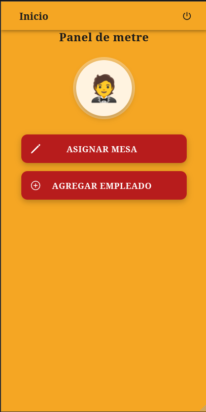</td>
    <td></td>
  </tr>
</table>
<details><summary>🔍 Ver en tamaño original</summary>

  
  
  
</details>

<table>
  <tr>
    <td></td>
    <td>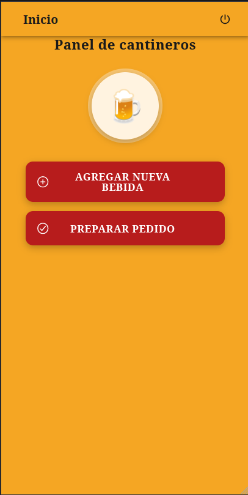</td>
    <td>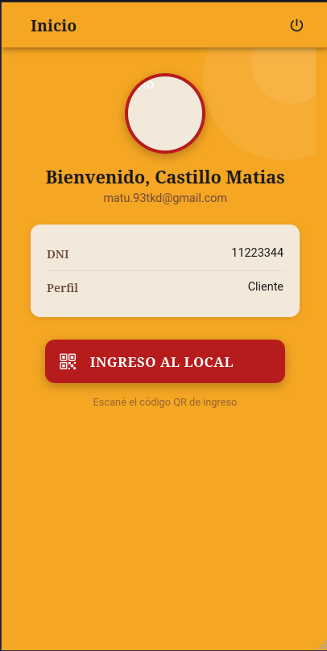</td>
  </tr>
</table>
<details><summary>🔍 Ver en tamaño original</summary>

  
  
  
</details>

---

### Gestión de mesas y productos

<table>
  <tr>
    <td>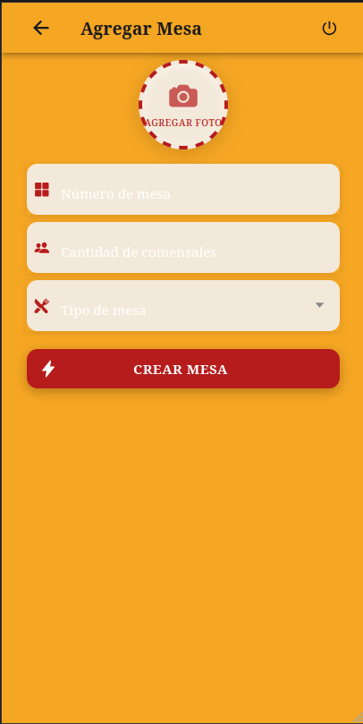</td>
    <td></td>
    <td>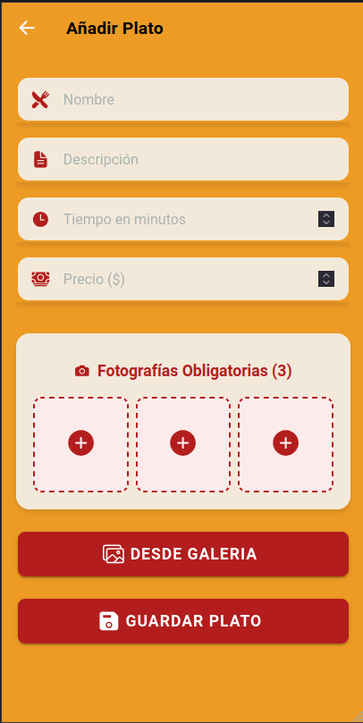</td>
  </tr>
</table>
<details><summary>🔍 Ver en tamaño original</summary>

  
  
  
</details>

---

### Pedidos

<table>
  <tr>
    <td>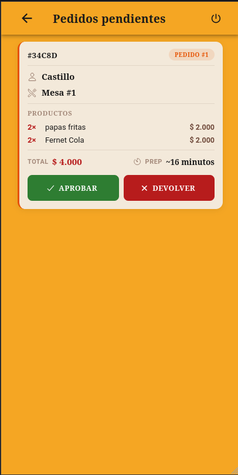</td>
    <td>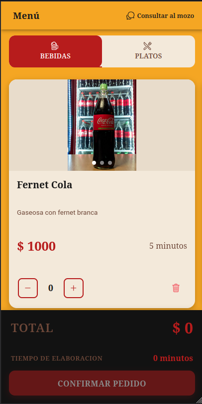</td>
    <td></td>
  </tr>
</table>
<details><summary>🔍 Ver en tamaño original</summary>

  
  
  
</details>

---

### Estados del pedido

<table>
  <tr>
    <td>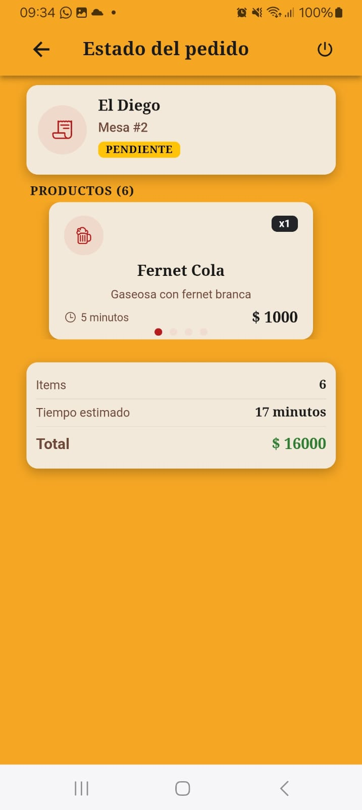</td>
    <td>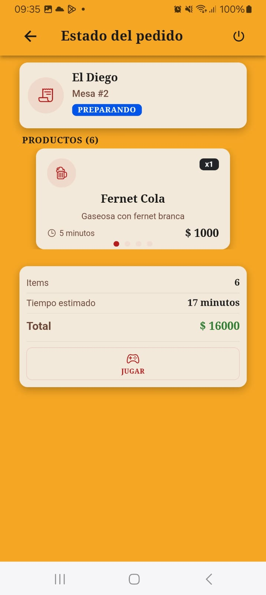</td>
    <td>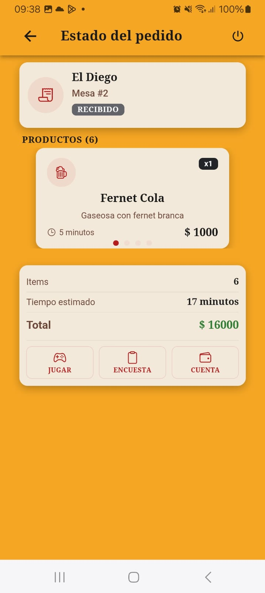</td>
  </tr>
</table>
<details><summary>🔍 Ver en tamaño original</summary>

  
  
  
</details>

<table>
  <tr>
    <td></td>
    <td></td>
    <td>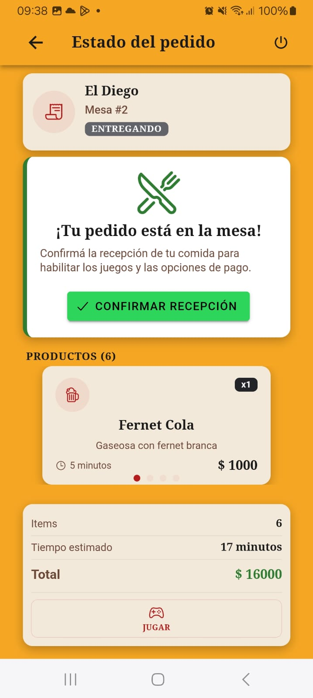</td>
  </tr>
</table>
<details><summary>🔍 Ver en tamaño original</summary>

  
  
  
</details>

---

### Chat en tiempo real

<table>
  <tr>
    <td>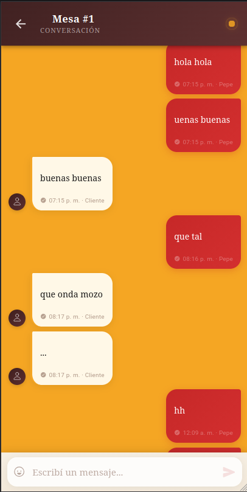</td>
    <td>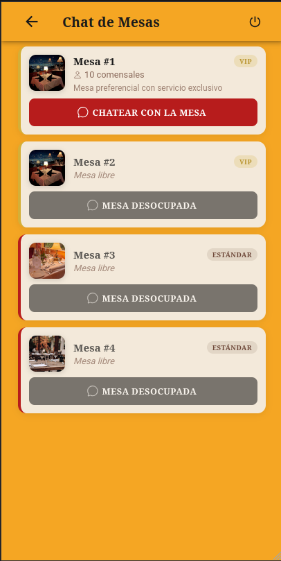</td>
  </tr>
</table>
<details><summary>🔍 Ver en tamaño original</summary>

  
  
</details>

---

### Juegos con descuentos

<table>
  <tr>
    <td>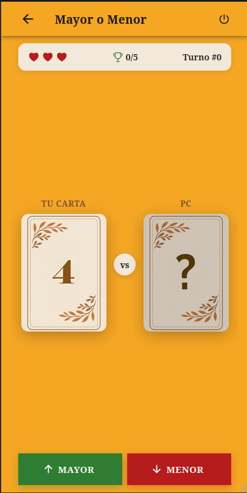</td>
    <td>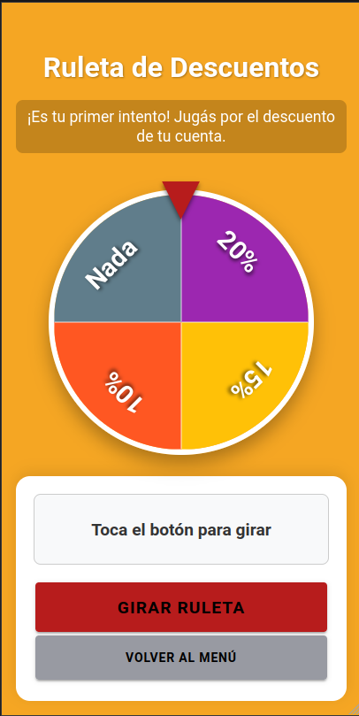</td>
    <td>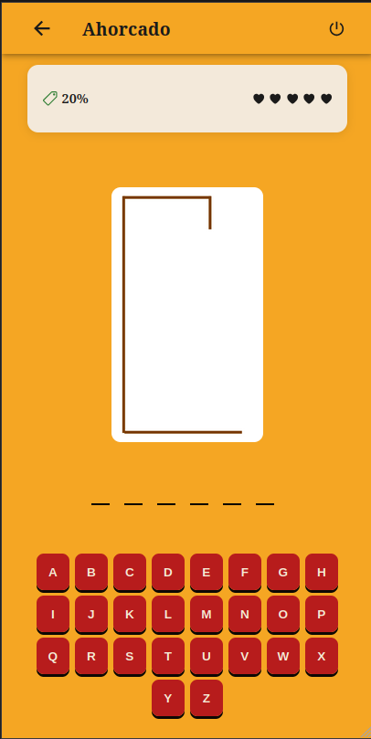</td>
  </tr>
</table>
<details><summary>🔍 Ver en tamaño original</summary>

  
  
  
</details>

<table>
  <tr>
    <td>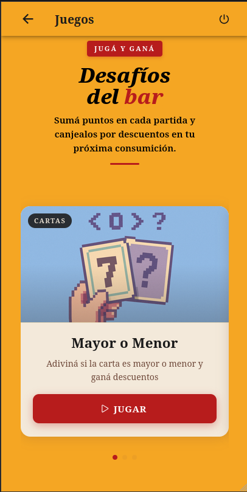</td>
  </tr>
</table>
<details><summary>🔍 Ver en tamaño original</summary>

  
</details>

---

### Encuestas de satisfacción

<table>
  <tr>
    <td>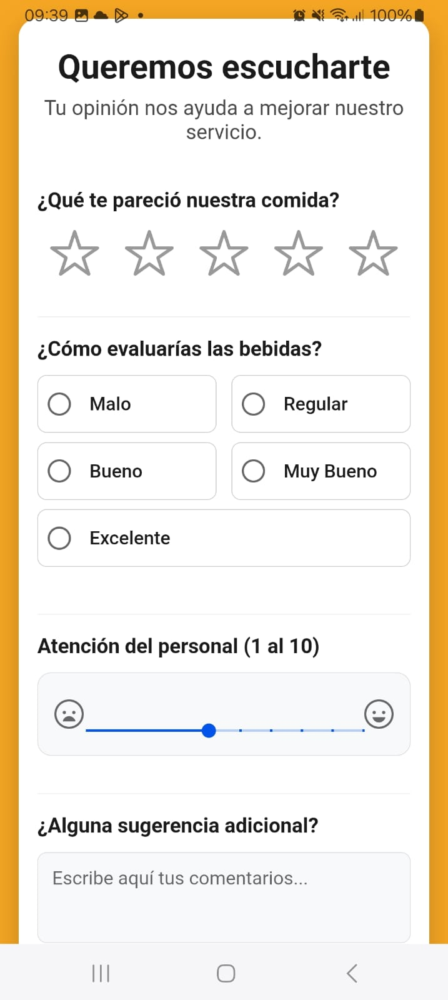</td>
    <td>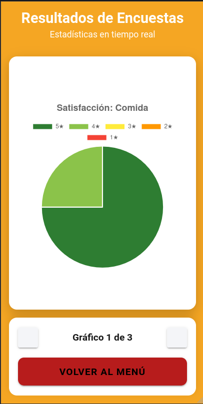</td>
    <td>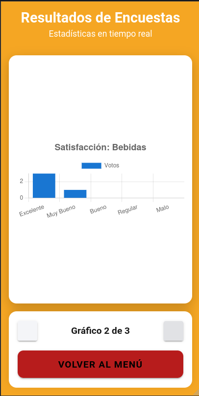</td>
  </tr>
</table>
<details><summary>🔍 Ver en tamaño original</summary>

  
  
  
</details>

<table>
  <tr>
    <td>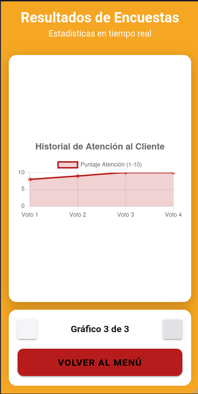</td>
  </tr>
</table>
<details><summary>🔍 Ver en tamaño original</summary>

  
</details>

---

### Cuenta y propina

<table>
  <tr>
    <td>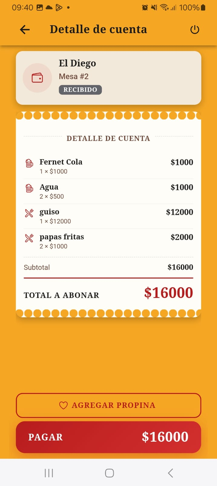</td>
    <td>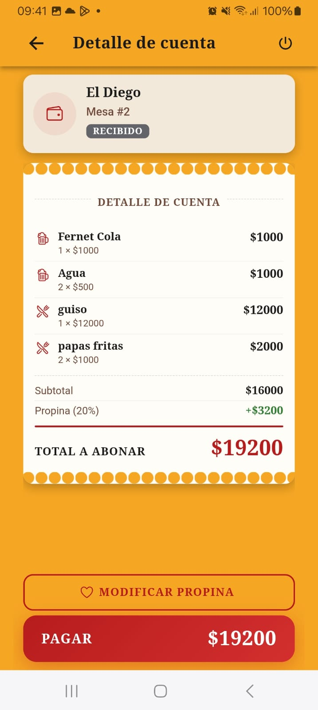</td>
    <td>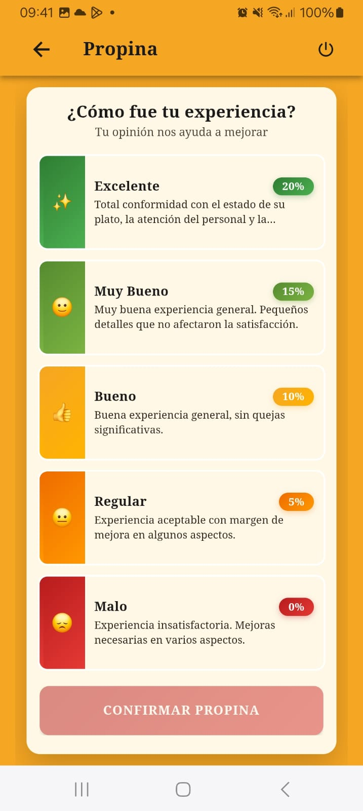</td>
  </tr>
</table>
<details><summary>🔍 Ver en tamaño original</summary>

  
  
  
</details>

---

## 📐 Diagramas

### Paleta de colores

<div align="center">
  
</div>
<details><summary>🔍 Ver en tamaño original</summary>

  
</details>

### DER (Modelo Entidad-Relación)

<div align="center">
  
</div>
<details><summary>🔍 Ver en tamaño original</summary>

  
</details>

### Flujo de la App

<div align="center">
  
</div>
<details><summary>🔍 Ver en tamaño original</summary>

  
</details>

### Flujo del pedido del cliente

<div align="center">
  
</div>
<details><summary>🔍 Ver en tamaño original</summary>

  
</details>

---

## 🎫 Códigos QR

### Ingreso al local

<div align="center">
  
</div>
<details><summary>🔍 Ver en tamaño original</summary>

  
</details>

### Mesas

<table>
  <tr>
    <td></td>
    <td></td>
    <td></td>
    <td></td>
    <td></td>
  </tr>
</table>
<details><summary>🔍 Ver en tamaño original</summary>

  
  
  
  
  
</details>

### Propinas

<div align="center">
  
</div>
<details><summary>🔍 Ver en tamaño original</summary>

  
</details>

---

## 🚀 Instalación

### Requisitos previos

- [Node.js](https://nodejs.org/) (recomendado LTS)
- [pnpm](https://pnpm.io/installation): `npm install -g pnpm`
- [Ionic CLI](https://ionicframework.com/docs/intro/cli): `pnpm add -g @ionic/cli`
- [Android Studio](https://developer.android.com/studio) (para compilar a APK)

### Setup

```bash
# Clonar el repositorio
git clone https://github.com/JuanDChaves/MJL-2026.git
cd MJL-2026/MJL-APP

# Instalar dependencias
pnpm install

# Iniciar servidor de desarrollo (http://localhost:4200)
pnpm start

# Build de producción
pnpm run build

# Linting
pnpm run lint

# Tests
pnpm run test
```

### Android

```bash
# Primera vez: build + agregar plataforma Android + sincronizar
pnpm run android:init

# Después de cambios: rebuild + copiar + sincronizar
pnpm run android:update

# Abrir en Android Studio
pnpm run android:open
```

---

## 📅 Entregas y división de tareas

<details>
<summary>Ver detalle de entregas anteriores</summary>

### Entrega Preliminar 7 — Primer Parcial — 06/06

| Integrante | Módulo | Rama |
|---|---|---|
| Briceño Castillo, Matías Emanuel | Envío de correo electrónico, UI pedidos pendientes, sala de chat, vibraciones | `fix/UI-pedidos-pendientes`, `feature/vibraciones`, `feature/sala-de-chat` |
| Pokoik, Lucia Laura | Form alta al menú, pedido cocina/bar | `fix/pedido-cocina-bar` |
| Chaves Rodriguez, Juan David | Home del Mozo, pedidos, sonidos | `feature/sonidos` |

---

### Entrega Preliminar 6 — 30/05

| Integrante | Módulo | Rama |
|---|---|---|
| Briceño Castillo, Matías Emanuel | Envío de correo electrónico, sala de chat, asignación de mesa, juegos, propinas | `feature/sala-de-chat`, `feature/asignacion-mesa`, `feature/juegos`, `feature/propinas` |
| Pokoik, Lucia Laura | Form alta al menú, ruleta, pedido cocina, entrega pedido | `juego/ruleta`, `feature/pedido-cocina`, `feature/entrega-pedido` |
| Chaves Rodriguez, Juan David | Home del Mozo, pedidos preparados, ahorcado | `feature/pedidos_preparados`, `feature/ahorcado2` |

---

### Entrega Preliminar 5 — 16/05

| Integrante | Módulo | Rama |
|---|---|---|
| Briceño Castillo, Matías Emanuel | Ingreso al local por QR | `feature/ingreso-post-qr-local` |
| Pokoik, Lucia Laura | Form alta al menú, agregar mesa | `feature/agregar-mesa` |
| Chaves Rodriguez, Juan David | Home del Mozo, pedidos | `feature/feature-pedidos` |

---

### Entrega Preliminar 4 — 09/05

| Integrante | Módulo | Rama |
|---|---|---|
| Briceño Castillo, Matías Emanuel | Envío de correo electrónico | `feature/sending-mail` |
| Pokoik, Lucia Laura | Form agregar al menú | `feature/form-agregar-a-menu` |
| Chaves Rodriguez, Juan David | Home del Mozo | `feature/home-mozo` |

---

### Entrega Preliminar 3 — 25/04

| Integrante | Módulo | Rama |
|---|---|---|
| Briceño Castillo, Matías Emanuel | Home del Dueño y Supervisor | `feature/HomeSupervisor` |
| Pokoik, Lucia Laura | Home del Cocinero | `home_cocinero` |
| Chaves Rodriguez, Juan David | Home del Mozo | `feature/home-mozo` |

---

### Entrega Preliminar 1 — 11/04

| Integrante | Módulo | Rama |
|---|---|---|
| Briceño Castillo, Matías Emanuel | Formulario Login | `feature/formulario-login` |
| Pokoik, Lucia Laura | Diseño del logo y UI | — |
| Chaves Rodriguez, Juan David | Splash Screen | `feature/splash-screen` |

</details>

---

## 📝 Convenciones de commits

Se utiliza el formato: `tipo: descripción` (todo en minúsculas)

| Tipo | Uso |
|------|-----|
| `feat` | Nueva funcionalidad |
| `fix` | Corrección de bug |
| `chore` | Mantenimiento (deps, config, tooling) |
| `docs` | Documentación |
| `style` | Formato (no afecta funcionalidad) |
| `refactor` | Refactorización de código |
| `test` | Agregar/corregir tests |
| `perf` | Mejoras de performance |
| `ci` | Cambios en CI/CD |
| `build` | Sistema de build |

### Ejemplos

```
feat: agregar formulario de registro
fix: corregir validación de email
chore: actualizar dependencias
docs: actualizar README
```
