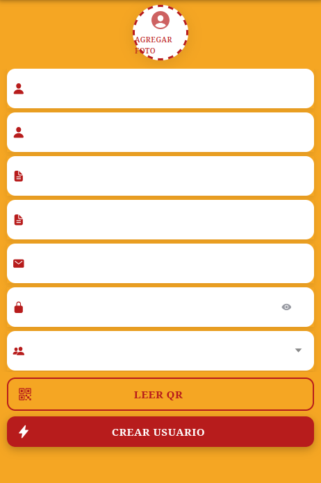
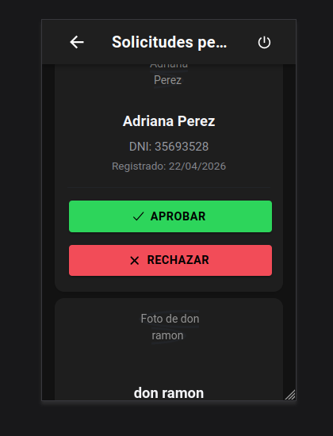
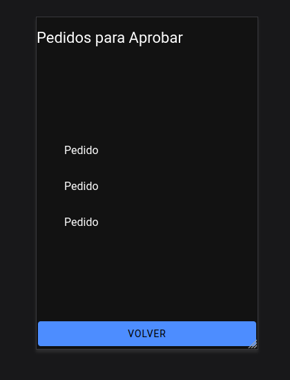

<div align="center">


# HTN — App de Gestión para Bar / Restaurante

Aplicación móvil híbrida que digitaliza la operación completa de un bar: ingreso al local con QR, pedidos, cocina/bar, pagos, juegos, encuestas y notificaciones push.


**Trabajo grupal · Materia Integradora · UTN · 2026**

</div>

---

## Tabla de Contenido

- [Descripción del proyecto](#descripción-del-proyecto)
- [Equipo](#equipo)
- [Stack tecnológico](#stack-tecnológico)
- [Arquitectura y buenas prácticas](#arquitectura-y-buenas-prácticas)
- [Funcionalidades](#funcionalidades)
- [Capturas de la App](#capturas-de-la-app)
- [Diagramas](#diagramas)
- [Códigos QR](#códigos-qr)
- [Base de datos](#base-de-datos)
- [Ejecución del proyecto](#ejecución-del-proyecto)
- [Convenciones de Commits](#convenciones-de-commits)

---

## Descripción del proyecto

**HTN** es una aplicación móvil para Android que cubre el flujo operativo completo de un bar/restaurante, de punta a punta:

> Registro y aprobación del cliente → ingreso al local escaneando un QR → asignación de mesa → pedido desde la carta digital → preparación en cocina y bar → entrega → cuenta con propina → pago confirmado por el mozo → encuesta de satisfacción.

El sistema maneja **7 perfiles** con funcionalidades específicas para cada rol: **dueño, supervisor, metre, mozo, cocinero, cantinero y cliente** (registrado o anónimo).

Los clientes nuevos quedan en estado **pendiente de aprobación**: un supervisor o dueño los habilita desde la app y el sistema les envía automáticamente un **email** con el resultado. El staff recibe **notificaciones push** en tiempo real ante cada evento relevante (nuevo cliente, nuevo pedido, pedido listo, pago, etc.), incluso con la app cerrada.

Proyecto desarrollado en equipo como **trabajo integrador de la carrera**, con entregas incrementales, división de módulos por integrante y flujo de trabajo con feature branches y pull requests.

---

## Equipo

Proyecto grupal de **3 integrantes**, con módulos asignados por persona en cada entrega:

| Integrante | Módulos principales |
|---|---|
| **Briceño Castillo, Matías Emanuel** | Login · Home dueño/supervisor · Emails transaccionales · Ingreso al local con QR · Chat en tiempo real · Asignación de mesas · Propinas · Vibraciones |
| **Pokoik, Lucía Laura** | Diseño UI/UX y logo · Alta de productos al menú · Alta de mesas · Home cocinero · Pedidos cocina/bar · Entrega de pedidos · Juego ruleta |
| **Chaves Rodriguez, Juan David** | Splash screen · Home mozo · Gestión de pedidos · Pedidos preparados · Sonidos · Juego ahorcado |

<details>
<summary><b>Ver registro completo de entregas (6 entregas preliminares)</b></summary>

### Entrega Preliminar 7 - Primer Parcial - 06/06

**Briceño Castillo, Matías Emanuel**
- Módulo: Envío de correo electrónico
- Inicio y fin: 31/05 - 05/06
- Branch: fix/UI-pedidos-pendientes, feature/vibraciones, feature/sala-de-chat

**Pokoik, Lucia Laura**
- Módulo: Form alta al menú
- Inicio y fin: 31/05 - 05/06
- Branch: fix/pedido-cocina-bar

**Chaves Rodriguez, Juan David**
- Módulo: Home del Mozo, pedidos
- Inicio y fin: 31/05 - 05/06
- Branch: feature/sonidos

---

### Entrega Preliminar 6 - 30/05

**Briceño Castillo, Matías Emanuel**
- Módulo: Envío de correo electrónico
- Inicio y fin: 17/05 - 30/05
- Branch: feature/sala-de-chat, feature/asignacion-mesa, feature/juegos, feature/propinas

**Pokoik, Lucia Laura**
- Módulo: Form alta al menú
- Inicio y fin: 17/05 - 30/05
- Branch: juego/ruleta, feature/pedido-cocina, feature/entrega-pedido

**Chaves Rodriguez, Juan David**
- Módulo: Home del Mozo, pedidos
- Inicio y fin: 17/05 - 30/05
- Branch: feature/pedidos_preparados, feature/ahorcado2

---

### Entrega Preliminar 5 - 16/05

**Briceño Castillo, Matías Emanuel**
- Módulo: Envío de correo electrónico
- Inicio y fin: 09/05 - 16/05
- Branch: feature/ingreso-post-qr-local

**Pokoik, Lucia Laura**
- Módulo: Form alta al menú
- Inicio y fin: 09/05 - 16/05
- Branch: feature/agregar-mesa

**Chaves Rodriguez, Juan David**
- Módulo: Home del Mozo, pedidos
- Inicio y fin: 09/05 - 16/05
- Branch: feature/feature-pedidos

---

### Entrega Preliminar 4 - 09/05

**Briceño Castillo, Matías Emanuel**
- Módulo: Envío de correo electrónico
- Inicio y fin: 25/04 - 08/05
- Branch: feature/sending-mail

**Pokoik, Lucia Laura**
- Módulo: Form alta al menú
- Inicio y fin: 25/04 - 08/05
- Branch: feature/form-agregar-a-menu

**Chaves Rodriguez, Juan David**
- Módulo: Home del Mozo, pedidos
- Inicio y fin: 25/04 - 08/05
- Branch: feature/home-mozo

---

### Entrega Preliminar 3 - 25/04

**Briceño Castillo, Matías Emanuel**
- Módulo: Home del Dueño y Supervisor
- Inicio y fin: 18/04 - 24/04
- Branch: feature/HomeSupervisor

**Pokoik, Lucia Laura**
- Módulo: Home del Cocinero
- Inicio y fin: 18/04 - 24/04
- Branch: home_cocinero

**Chaves Rodriguez, Juan David**
- Módulo: Home del Mozo
- Inicio y fin: 18/04 - 24/04
- Branch: feature/home-mozo

---

### Entrega Preliminar 1 - 11/04

**Briceño Castillo, Matías Emanuel**
- Módulo: Formulario Login
- Inicio y fin: 05/04 - 10/04
- Branch: feature/formulario-login

**Pokoik, Lucia Laura**
- Módulo: Diseño del logo y la UI
- Inicio y fin: 05/04 - 10/04

**Chaves Rodriguez, Juan David**
- Módulo: Splash Screen
- Inicio y fin: 05/04 - 10/04
- Branch: feature/splash-screen

</details>

---

## Stack tecnológico

| Capa | Tecnologías |
|---|---|
| **Frontend** | Ionic 8 · Angular 20 (standalone components + signals) · TypeScript 5.9 · RxJS |
| **Backend (BaaS)** | Supabase: Auth · PostgreSQL · Realtime · Storage · Edge Functions (Deno) |
| **Servicios externos** | Firebase Cloud Messaging (push) · Resend (emails transaccionales) |
| **Nativo** | Capacitor 8: barcode-scanner · camera · haptics · push-notifications · native-audio · preferences · status-bar · keyboard |
| **Librerías** | chart.js (gráficos de encuestas) · howler (sonido) · swiper · qrcode |
| **Tooling** | pnpm · ESLint (angular-eslint) · Karma/Jasmine · Supabase CLI |

---

## Arquitectura y buenas prácticas

### Estructura del código

```
MJL-APP/
├── src/app/
│   ├── components/     # Componentes standalone por feature (login, pedidos, chat, juegos, ...)
│   ├── pages/          # Páginas Ionic
│   ├── services/       # Capa de servicios (29 servicios: datos, push, QR, sonido, ...)
│   ├── guards/         # Guards de ruta por perfil
│   ├── interfaces/     # 25 contratos de dominio tipados
│   ├── pipes/          # Pipes de presentación
│   └── types/          # Tipos auxiliares
├── supabase/           # Config local de Supabase
└── docs/               # Capturas, diagramas y QRs
supabase/
├── functions/          # Edge Functions (Deno): create-user, push, send-email
└── migrations/         # Migraciones SQL versionadas
```

### Patrones

- **Standalone components + lazy loading**: el 100% de las rutas usa `loadComponent`, generando chunks por feature y un bundle inicial mínimo.
- **Estado reactivo con Angular Signals** + `toObservable` para interoperar con RxJS (estado de autenticación).
- **Capa de servicios con patrón resultado** (`IResult<T>`): manejo de errores uniforme sin propagar excepciones a la UI.
- **Inyección de dependencias moderna** con `inject()` y `providedIn: 'root'`.
- **Tipos de base de datos generados desde el esquema real** (`database.types.ts` vía `supabase gen types`) → consultas type-safe de punta a punta.
- **Formularios reactivos** (ReactiveFormsModule) con validaciones declarativas.
- **Diseño de UI sistematizado**: paleta de colores, tipografía, border-radius, sombras y animaciones definidas como patrones globales.

### Seguridad

- **Row Level Security (RLS)** habilitado en las tablas de la base de datos.
- **Constraints a nivel DB**: enum `perfil_rol` para los perfiles, regex de email, rango y unicidad de CUIL, índices parciales, triggers de `updated_at`.
- **La `service_role` key nunca llega al cliente**: solo se usa dentro de Edge Functions (variables de entorno de Deno). El frontend usa únicamente la publishable key.
- **Operaciones privilegiadas server-side**: creación de usuarios, envío de push y envío de emails se ejecutan en Edge Functions.
- **Flujo de aprobación de clientes**: todo cliente nuevo nace con `activo = false` hasta que un supervisor/dueño lo habilita.
- **Guards de ruta por perfil**: control de acceso a pantallas según el rol del usuario autenticado.

### Edge Functions (Deno)

| Función | Disparo | Responsabilidad |
|---|---|---|
| `create-user` | HTTP desde la app | Alta en `auth.users` con service role (sin exponer la key al cliente) |
| `push` | Webhook DB (`INSERT` en `notifications`) | Busca destinatarios por perfil con `fcm_token` y envía push vía **FCM API v1** (autenticación JWT con service account) |
| `send-email` | HTTP desde la app | Email de aprobación/rechazo con template HTML branding vía **Resend** |

### Calidad y flujo de trabajo

- **ESLint con reglas de Angular**: sufijos `Page`/`Component`, prefijo `app-`, selectores kebab-case/camelCase.
- **Conventional commits** (`feat:`, `fix:`, `chore:`, ...) — ver [sección](#convenciones-de-commits).
- **Feature-branch workflow**: una rama por funcionalidad, integración vía pull requests (60+ ramas en el repo).
- **Migraciones SQL versionadas** con Supabase CLI.
- **Budgets de build** configurados en `angular.json` para controlar el peso de bundles y estilos.

---

## Funcionalidades

### Autenticación y perfiles
- Login con accesos rápidos por perfil (para demo y testing).
- Registro de clientes con foto de perfil y validaciones.
- Clientes anónimos (ingreso rápido sin registro).
- Panel de aprobación de clientes para supervisor/dueño, con email automático del resultado.

### Operación del local
- Ingreso al local escaneando QR → lista de espera → asignación de mesa (metre).
- Alta de mesas con QR propio.
- Alta de productos al menú con foto.
- Carta digital para el cliente.

### Ciclo del pedido
- Pedido del cliente desde su mesa.
- Derivación automática a cocina y bar según el tipo de producto.
- Estados: pendiente → en preparación → listo → entregado.
- Detalle de cuenta y propina por QR.
- Confirmación de pago por parte del mozo.

### Engagement
- Chat en tiempo real mozo ↔ cliente por mesa (Supabase Realtime).
- Juegos con descuentos: **ruleta, mayor-menor y ahorcado**.
- Encuestas de satisfacción con gráficos estadísticos (chart.js).
- Notificaciones push (FCM) al staff y al cliente.
- Sonidos y vibración en eventos clave de la operación.

---

## Capturas de la App

> Tocá cualquier miniatura para ver la imagen en tamaño original.

### Identidad visual

<div align="center">
  
</div>

### Splash y autenticación

<table align="center">
  <tr>
    <td align="center">
      <details>
        <summary></summary>
        
      </details>
      <br/><sub>Splash screen</sub>
    </td>
    <td align="center">
      <details>
        <summary></summary>
        
      </details>
      <br/><sub>Login</sub>
    </td>
    <td align="center">
      <details>
        <summary></summary>
        
      </details>
      <br/><sub>Login completado</sub>
    </td>
    <td align="center">
      <details>
        <summary></summary>
        
      </details>
      <br/><sub>Accesos directos</sub>
    </td>
  </tr>
</table>

### Dueño / Supervisor

<table align="center">
  <tr>
    <td align="center">
      <details>
        <summary></summary>
        
      </details>
      <br/><sub>Home supervisor</sub>
    </td>
    <td align="center">
      <details>
        <summary></summary>
        
      </details>
      <br/><sub>Alta de cliente</sub>
    </td>
    <td align="center">
      <details>
        <summary></summary>
        
      </details>
      <br/><sub>Clientes anónimos</sub>
    </td>
  </tr>
</table>

### Cocina y menú

<table align="center">
  <tr>
    <td align="center">
      <details>
        <summary></summary>
        
      </details>
      <br/><sub>Home cocinero</sub>
    </td>
    <td align="center">
      <details>
        <summary></summary>
        
      </details>
      <br/><sub>Alta de plato</sub>
    </td>
  </tr>
</table>

### Mozo y pedidos

<table align="center">
  <tr>
    <td align="center">
      <details>
        <summary></summary>
        
      </details>
      <br/><sub>Home mozo</sub>
    </td>
    <td align="center">
      <details>
        <summary></summary>
        
      </details>
      <br/><sub>Pedidos</sub>
    </td>
    <td align="center">
      <details>
        <summary></summary>
        
      </details>
      <br/><sub>Pedidos pendientes</sub>
    </td>
  </tr>
</table>

---

## Diagramas

> Tocá cualquier miniatura para ver el diagrama en tamaño original.

### DER — Modelo de datos inicial

<div align="center">
  <details>
    <summary></summary>
    
  </details>
</div>

### Flujo general de la app

<div align="center">
  <details>
    <summary></summary>
    
  </details>
</div>

### Flujo del pedido del cliente

<div align="center">
  <details>
    <summary></summary>
    
  </details>
</div>

---

## Códigos QR

### Ingreso y propinas

<table align="center">
  <tr>
    <td align="center">
      
      <br/><sub>Ingreso al local</sub>
    </td>
    <td align="center">
      
      <br/><sub>Propinas</sub>
    </td>
  </tr>
</table>

### Mesas

<table align="center">
  <tr>
    <td align="center"><br/><sub>Mesa 1</sub></td>
    <td align="center"><br/><sub>Mesa 2</sub></td>
    <td align="center"><br/><sub>Mesa 3</sub></td>
    <td align="center"><br/><sub>Mesa 4</sub></td>
    <td align="center"><br/><sub>Mesa 5</sub></td>
  </tr>
</table>

---

## Base de datos

| Tabla | Descripción |
|---|---|
| `usuarios` | Personal y clientes, vinculados a `auth.users`. Enum de perfiles, flag `activo`, token FCM |
| `solicitudes` | Registros de clientes pendientes de aprobación |
| `mesas` | Mesas del local y su estado |
| `productos` | Carta: platos y bebidas |
| `pedidos` | Pedidos por mesa con su estado |
| `productos_pedido` | Detalle de productos por pedido |
| `notifications` | Cola de eventos que disparan push vía webhook → Edge Function |
| `chat` | Mensajería en tiempo real mozo ↔ cliente (Supabase Realtime) |

---

## Ejecución del proyecto

**Prerequisitos:** Node.js 20+, pnpm, Ionic CLI y Android Studio (para el build nativo).

```bash
cd MJL-APP
pnpm install
pnpm start        # dev server → http://localhost:4200
```

| Comando | Descripción |
|---|---|
| `pnpm run build` | Build de producción → `www/` |
| `pnpm run lint` | Análisis estático con ESLint |
| `pnpm run test` | Tests con Karma/Jasmine |
| `pnpm run android:init` | Primera vez: build + add android + sync |
| `pnpm run android:update` | Post-cambios: build + copy + sync |
| `pnpm run android:open` | Abrir el proyecto en Android Studio |

---

## Convenciones de Commits

Se usa el formato: `tipo: descripción` (lowercase)

| Tipo | Uso |
|------|-----|
| `feat` | Nueva funcionalidad |
| `fix` | Corrección de bug |
| `chore` | Mantenimiento (deps, config, tooling) |
| `docs` | Documentación |
| `style` | Formato (no afecta funcionalidad) |
| `refactor` | Refactorización de código |
| `test` | Agregar/corregir tests |
| `perf` | Mejoras de performance |
| `ci` | Cambios en CI/CD |
| `build` | Build system |

### Ejemplos

```
feat: agregar formulario de registro
fix: corregir validación de email
chore: actualizar dependencias
docs: actualizar README
```
