# MJL-2026

<!--  -->

App móvil para la hamburguesería HTN 

## Tabla de Contenido
- [Introducción](#introducción)
- [Funcionalidades de la App](#funcionalidades-de-la-app)
- [Tareas del equipo](#tareas-del-equipo)
- [Convenciones de Commits](#convenciones-de-commits)

## Introducción
_Completar_
## Funcionalidades de la App
### UI - Pantallas

#### Paleta de Color
<div align="center">
    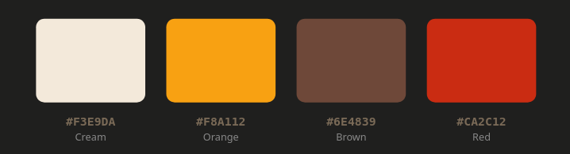
</div>

#### Splash Screen Estático
<div align="center">
    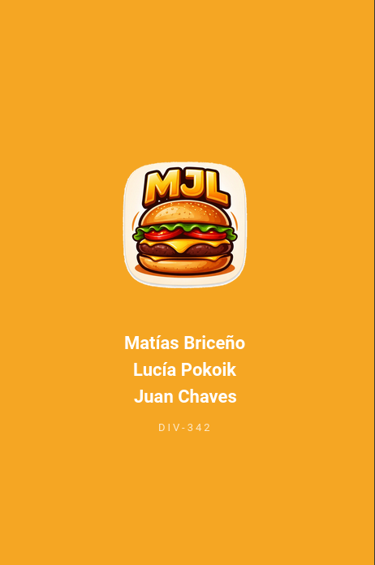
</div>

#### Login
<div align="center">
    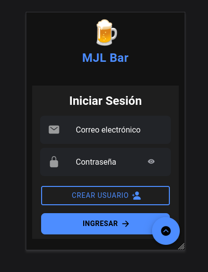
    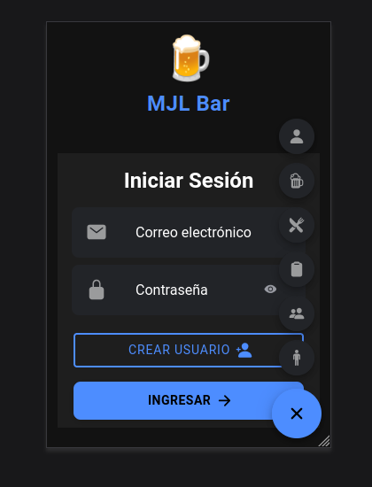
</div>

#### Home Supervisor-Dueño 
<div align="center">
    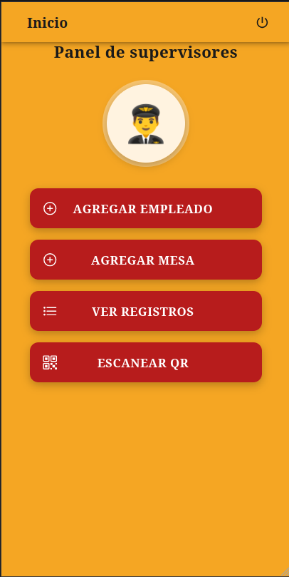
</div>

#### Home Cocinero
<div align="center">
    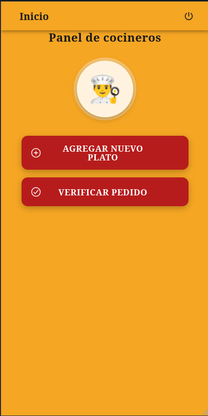
</div>

#### Form Agregar Plato 
<div align="center">
    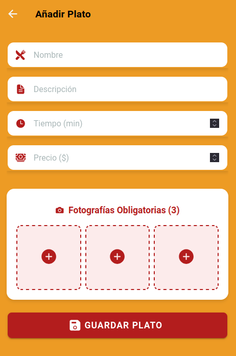
</div>

#### Home Mozo
<div align="center">
    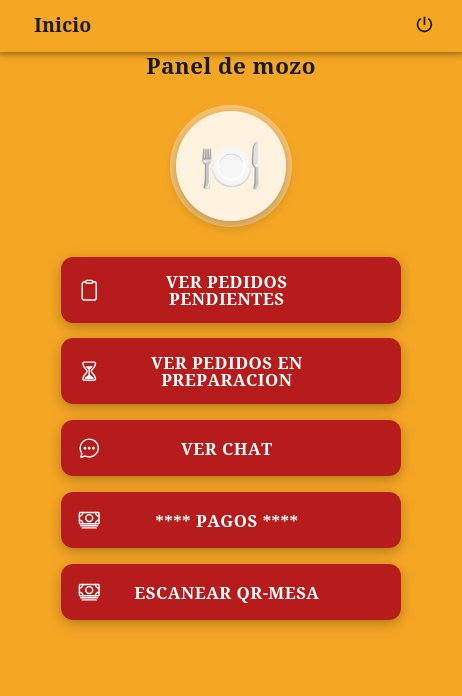
</div>

#### Pedidos Pendientes
<div align="center">
    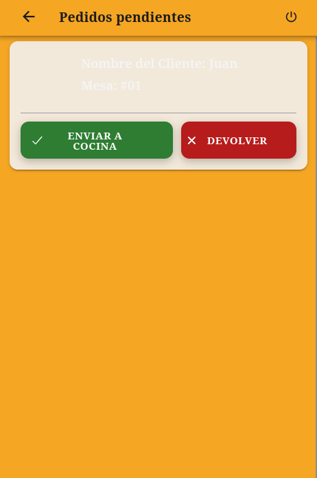
</div>

### Diagramas
#### DER inicial 
<div align="center">
    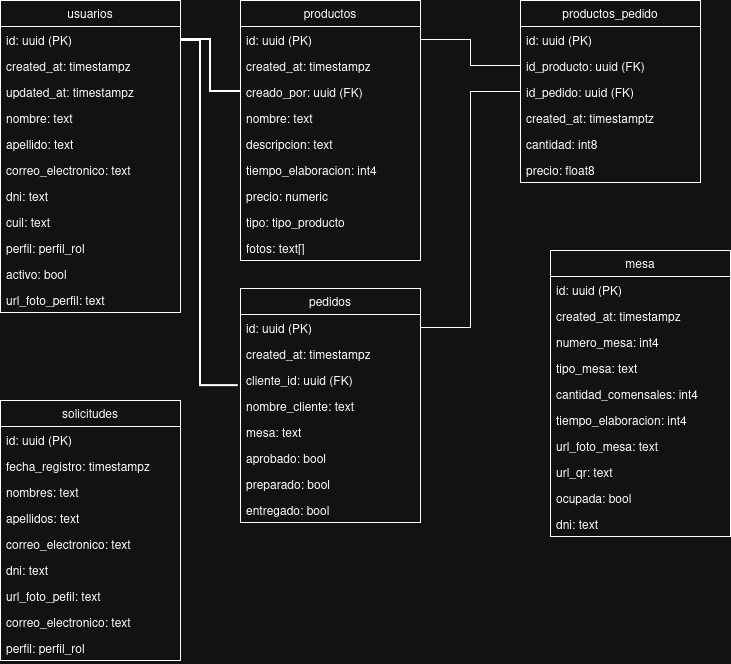
</div>

#### Diagrama de flujo de la app
<div align="center">
    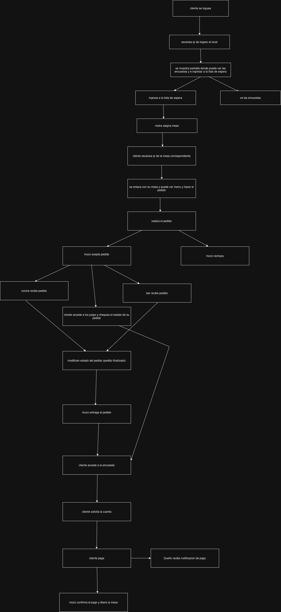
</div>

#### Flujo de un pedido.
<div align="center">
    
</div>

### QRs
#### Ingreso local
<div align="center">
    
</div>

#### Mesas  
<div align="center">
    
</div>
<div align="center">
    
</div>
<div align="center">
    
</div>
<div align="center">
    
</div>
<div align="center">
    
</div>

## Tareas del equipo

### Entrega Preliminar 7 - Primer Parcial - 06/06  
### Briceño Castillo, Matías Emanuel 
- Módulo: Envio de correo electrónico.  
- Inicio y fin: 31/05 - 05/06
- Branch: fix/UI-pedidos-pendientes, feature/vibraciones, feature/sala-de-chat

### Pokoik, Lucia Laura 
- Módulo: Form alta al menú 
- Inicio y fin: 31/05 - 05/06
- Branch: fix/pedido-cocina-bar 

### Chaves Rodriguez, Juan David 
- Módulo: Home del Mozo, pedidos
- Inicio y fin: 31/05 - 05/06
- Branch: feature/sonidos 

---

### Entrega Preliminar 6 - 30/05 
### Briceño Castillo, Matías Emanuel 
- Módulo: Envio de correo electrónico.  
- Inicio y fin: 17/05 - 30/05 
- Branch: feature/sala-de-chat, feature/asignacion-mesa, feature/juegos, feature/propinas

### Pokoik, Lucia Laura 
- Módulo: Form alta al menú 
- Inicio y fin: 17/05 - 30/05 
- Branch: juego/ruleta, feature/pedido-cocina, feature/entrega-pedido

### Chaves Rodriguez, Juan David 
- Módulo: Home del Mozo, pedidos
- Inicio y fin: 17/05 - 30/05 
- Branch: feature/pedidos_preparados, feature/ahorcado2

---


### Entrega Preliminar 5 - 16/05 
### Briceño Castillo, Matías Emanuel 
- Módulo: Envio de correo electrónico.  
- Inicio y fin: 09/05 - 16/05 
- Branch: feature/ingreso-post-qr-local

### Pokoik, Lucia Laura 
- Módulo: Form alta al menú 
- Inicio y fin: 09/05 - 16/05 
- Branch: feature/agregar-mesa

### Chaves Rodriguez, Juan David 
- Módulo: Home del Mozo, pedidos
- Inicio y fin: 09/05 - 16/05 
- Branch: feature/feature-pedidos

---

### Entrega Preliminar 4 - 09/05 
### Briceño Castillo, Matías Emanuel 
- Módulo: Envio de correo electrónico.  
- Inicio y fin: 25/04 - 08/05 
- Branch: feature/sending-mail

### Pokoik, Lucia Laura 
- Módulo: Form alta al menú 
- Inicio y fin: 25/04 - 08/05 
- Branch: feature/form-agregar-a-menu 

### Chaves Rodriguez, Juan David 
- Módulo: Home del Mozo, pedidos
- Inicio y fin: 25/04 - 08/05 
- Branch: feature/home-mozo

---
### Entrega Preliminar 3 - 25/04 
### Briceño Castillo, Matías Emanuel 
- Módulo: Home del Dueño y Supervisor  
- Inicio y fin: 18/04 - 24/04
- Branch: feature/HomeSupervisor

### Pokoik, Lucia Laura 
- Módulo: Home del Cocinero 
- Inicio y fin: 18/04 - 24/04
- Branch: home_cocinero

### Chaves Rodriguez, Juan David 
- Módulo: Home del Mozo 
- Inicio y fin: 18/04 - 24/04
- Branch: feature/home-mozo

---
### Entrega Preliminar 1 - 11/04

### Briceño Castillo, Matías Emanuel 
- Módulo: Formulario Login
- Inicio y fin: 05/04 - 10/04
- Branch: feature/formulario-login

### Pokoik, Lucia Laura 
- Módulo: Diseño del logo y la UI en Tailwind
- Inicio y fin: 05/04 - 10/04
- Branch: ***

### Chaves Rodriguez, Juan David 
- Módulo: Splash Screen
- Inicio y fin: 05/04 - 10/04
- Branch: feature/splash-screen
## Convenciones de Commits

Se usa el formato: `tipo: descripción` ( lowercase )

| Tipo | Uso |
|------|-----|
| `feat` | Nueva funcionalidad |
| `fix` | Corrección de bug |
| `chore` | Mantenimiento (deps, config, tooling) |
| `docs` | Documentación |
| `style` | Formato (no afecta funcionalidad) |
| `refactor` | Refactorización de código |
| `test` | Agregar/corregir tests |
| `perf` | Mejoras de performance |
| `ci` | Cambios en CI/CD |
| `build` | Build system |

### Ejemplos
```
feat: agregar formulario de registro
fix: corregir validación de email
chore: actualizar dependencias
docs: actualizar README
```


lu empieza con juegos y encuestas
Juan sigue con lo del mozo
matias metre y cliente

Y el miercoles rotamos

lu sigue concina y bar
Juan rota a su juego
matias juego chat